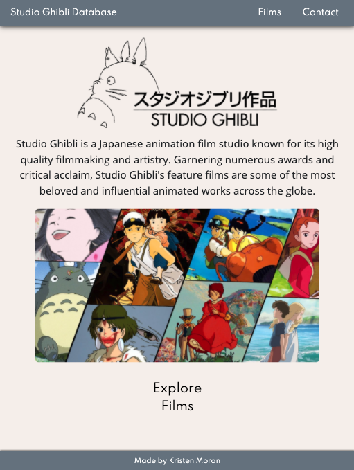
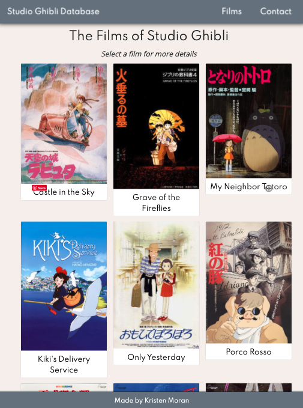
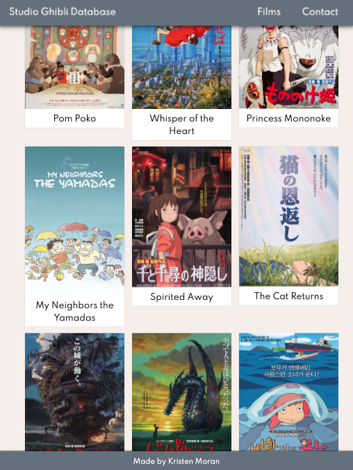
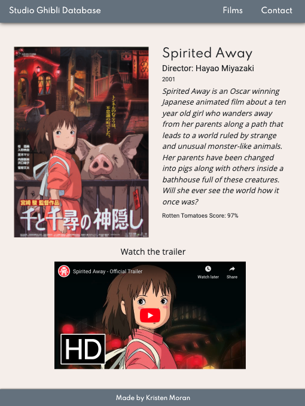

# Studio Ghibli Database

## Project Description

My second project for General Assembly's Software Engineering Immersive was to build a front-end application using the React framework and utilizing an API. I chose to build a movie database for one of my favorite animation studios, Studio Ghibli.

The API I used was the [Studio Ghibli API](https://ghibliapi.herokuapp.com/#).

The problem this project solves is that not many people have seen Studio Ghibli films. This database offers a place for people to learn more about the films and drive interest in watching the films. This database serves as an introduction to films of Studio Ghibli!

The result can be viewed here: [Studio Ghibli Database](https://studioghiblidatabase.herokuapp.com/)

## From the Database

### Homepage



### Film List Page



### Film List Page Cont'd



### Individual Movie Page



## Features/User Stories

## User Stories

- _As a user, I want to see a listing of all the movies Studio Ghibli has made._
- _As a user, I want to click on a specific movie and read a description of the movie and further details like, director, Rotten Tomato score, and release date._
- _As a user, I want to easily navigate the movies on my mobile device so I can view movie details._
- _As a user, I would like to view the trailer of the movie._

_**Post Stretch Goal**_

- _As a user, I would like to be able to search for movies by name so I can easily find a movie and view its details._
- _As a user, I would like to be recommended a movie to watch._

## Issues/Hurdles

The the Studio Ghibli API is a great resource for information about the Studio's films, however, images and links to the trailers were not included in the API. I had to find all the film posters and trailer links.

The tricky part was going to match up the correct poster with the movie title. I decided to locally host the film posters and not pull in a link that may remove the image later. Luckily, the Studio Ghibli API has unique Ids for each movie so I made a separate file and matched up the Id with the poster image's path. The issue I came across was that with React, images have to be imported (ie 'import castleinthesky from 'imgs/posters/castleinsky.png') in order for the image ot display properly. So in my file, I imported the posters path and then listed it in the object with the corresponding Id.

Then in order to link up the correct image with it's movie information, I utilized the find() method, passed down the props, and matched the movie poster with the API Id.

I created a separate file for the YouTube links as well and used React Player to display the trailers.

## Technologies and Frameworks Used

- HTML5, CSS, JavaScript, React, React Hooks, React Router, React Player, Bootstrap

## Installation

```
Install Studio Ghibli Data:
1. Fork & clone the repository
2. Add/enhance features and technologies!
3. Submit any issues
```

## Contribute

[Source Code](https://github.com/kristenmoran/project-2)
[Issue Tracker](https://github.com/kristenmoran/project-2/issues)
